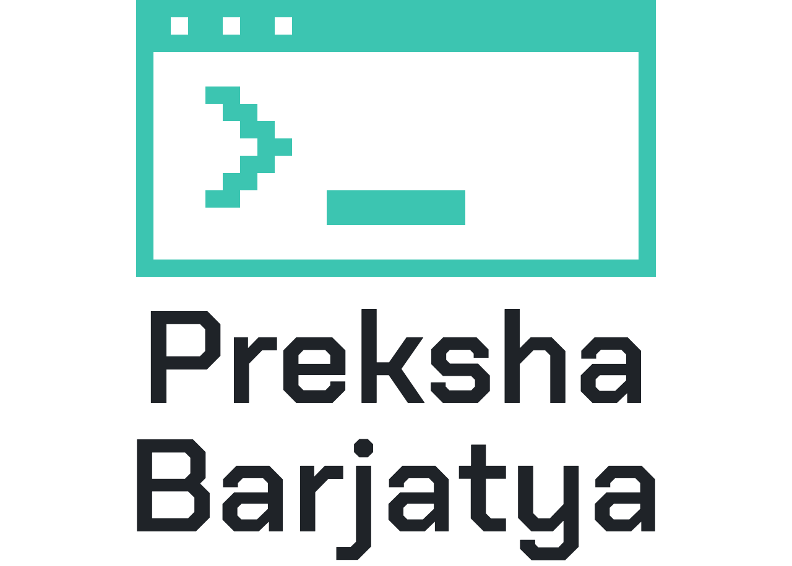

<h1 align="center">
	<a href="https://github.com/Prekshabarjatya">
		<picture>
			<source media="(prefers-color-scheme: dark)" srcset="media/header-dark.png">
			
		</picture>
	</a>
</h1>

<p align="center">
	<a href="https://linkedin.com/in/preksha-barjatya-pb2024">
		
	</a>
</p>

<p align="center">AI systems with real guardrails: RAG, agentic workflows, FastAPI backends and data pipelines.</p>

<p align="center"><sub>B.Tech CSE (AI & ML) · Acropolis Institute of Technology and Research · 2023 → 2027. Each heading links to the source code.</sub></p>

<hr>

<p align="center"><em>Goal: build production-grade AI systems. Find me on <a href="https://linkedin.com/in/preksha-barjatya-pb2024">LinkedIn</a>.</em></p>

## Contents

- [AI systems](#ai-systems)
- [Data projects](#data-projects)
- [Tech stack](#tech-stack)
- [Experience](#experience)
- [Education & certifications](#education--certifications)
- [Currently learning](#currently-learning)
- [Glossary](#glossary)
- [Let's connect](#lets-connect)

## AI systems

Multi-step LLM systems built with LangGraph and FastAPI. Wherever a result has to be right, plain code checks it.

### [Research Desk](https://github.com/Prekshabarjatya/research-desk) 📚

Turns an assignment into a cited, literature-based research paper. Human approval gates, citations verified against Crossref in code, and runs that survive crashes. [^1]

Live demo: [research-paper-agents.vercel.app](https://research-paper-agents.vercel.app)

| Step                     | What it does                                                                         | Built with          |
| ------------------------ | ------------------------------------------------------------------------------------ | ------------------- |
| Analyst → topic          | Reads the assignment and proposes a topic; you approve it                            | LangGraph           |
| Source scout             | Searches OpenAlex and Semantic Scholar; keeps a paper only if its DOI resolves in Crossref | Python, Crossref API |
| Thesis → outline → draft | You approve the thesis; the writer may cite only verified `[S#]` sources             | LLM                 |
| Critic                   | Sends the draft back for a rewrite or more sources, up to `MAX_REVISIONS` rounds     | LLM                 |
| Worker                   | Checkpoints every step in Postgres; a crashed run resumes on another worker          | FastAPI, Postgres   |

### [AI Research Assistant](https://github.com/Prekshabarjatya/ai-research-assistant) 🔎

Document Q&A that answers only from retrieved passages and cites them. Ships as one Docker image with its own frontend.

| Step            | What it does                                                                 | Built with         |
| --------------- | ---------------------------------------------------------------------------- | ------------------ |
| Ingest + chunk  | Markdown, text or PDF, split into overlapping passages                       | Python, LangChain  |
| Retrieve        | TF-IDF index, cosine similarity, top-k above a relevance floor               | TF-IDF             |
| Synthesize      | The model answers only from the retrieved passages and names its source      | Groq, LangChain    |
| `/api/research` | Three agents: gather (local + web), draft a cited report, review and revise  | LangGraph, Tavily  |
| Serve           | API and UI from the same process                                             | FastAPI, Docker    |

### [AI E-Commerce Listing Optimizer](https://github.com/Prekshabarjatya/ecommerce-listing-optimizer-ai) 🛒

Rewrites marketplace product listings for search and conversion, grounded in the seller's real brand facts and fact-checked before anything ships.

| Step           | What it does                                                                         | Built with                  |
| -------------- | ------------------------------------------------------------------------------------ | --------------------------- |
| Ingestion      | Meesho Excel exports → validated product records, columns matched by name            | Python                      |
| RAG            | Pulls brand and product facts from the seller's knowledge base                       | TF-IDF retrieval            |
| Agents         | Audit the current listing → write a new one → a critic scores it, optionally on another model | Groq LLMs           |
| Fact validator | Checks copy against approved and blocked claims; a rule, not an LLM call              | Python                      |
| Review         | Human review queue before anything is exported                                        | Streamlit, Postgres, Render |

### [Resume Intelligence](https://github.com/Prekshabarjatya/resume-intelligence-ai) 📄

Upload a resume and a job description; get structured profiles, a 0–100 match score and an explainable gap analysis.

| Step                   | What it does                                                          | Built with           |
| ---------------------- | --------------------------------------------------------------------- | -------------------- |
| Ingestion              | Reads PDF, DOCX or plain text                                          | PyMuPDF, python-docx |
| Validate + extract     | Rejects anything that isn't a resume or a JD, then extracts profiles  | LangGraph, Pydantic  |
| Match skills           | Exact match first, then an LLM synonym check for the rest             | Groq                 |
| Score                  | ATS heuristics and a weighted score, computed in code                 | Python               |
| Gaps + recommendations | Grounded in the computed matches and scores                           | LLM                  |

## Data projects

Analysis and pipeline work.

| Project                                                                   | What it is                                                                   | Built with                     |
| ------------------------------------------------------------------------- | ---------------------------------------------------------------------------- | ------------------------------ |
| [Stock Momentum EDA](https://github.com/Prekshabarjatya/stock-momentum-eda) 📈 | NIFTY 50 exploratory analysis with a custom momentum scoring framework | Python, Pandas, SQL            |
| Thermal Guard AI 🌡️                                                       | Data ingestion and geospatial processing for real-time urban heat analytics  | Python, APIs, geospatial data  |

## Tech stack

| Area                  | Tools |
| --------------------- | ----- |
| **Languages**         |    |
| **AI / ML**           |      · embeddings, vector search, prompt engineering |
| **Backend**           |   · REST APIs, API design |
| **Data**              |    · EDA, feature engineering, data pipelines |
| **Cloud & DevOps**    |      · ECR, ECS |
| **BI & visualization** |   |

## Experience

| Role                | Company                    | Year | Focus                                                         |
| ------------------- | -------------------------- | ---- | ------------------------------------------------------------- |
| AI Engineer Intern  | Santerra Hygiene Pvt. Ltd. | 2026 | AI automation, Python, prompt engineering, model integration  |
| Data Analyst Intern | Think AI Corporation       | 2026 | Python, SQL, Power BI, Tableau, EDA, data pipelines           |

## Education & certifications

**B.Tech. Computer Science Engineering (AI & ML)**, Acropolis Institute of Technology and Research · `2023 → 2027` · CGPA 7.94

| Certification                                       | Organization              |
| :-------------------------------------------------- | :------------------------ |
| 🏅 Agentic AI Certified Foundations Associate       | Oracle                    |
| 🐍 Programming with Python Professional Certificate | OpenEDG Python Institute  |
| 🤖 Generative AI, RAG, Multimodal & Agentic AI      | Acropolis × Navigate Labs |

## Currently learning

`Production Python` → `FastAPI` → `PostgreSQL` → `Redis` → `Docker` → `AWS` → `Kubernetes`

```text
$ git status
AI Engineering    ████████████████████░░
Generative AI     ███████████████████░░░
Backend           ████████████████░░░░░
Data Engineering  █████████████████░░░░
Cloud / DevOps    █████████████░░░░░░░░

status: building.
```

## Glossary

| Abbreviation | Meaning                        |
| ------------ | ------------------------------ |
| **RAG**      | Retrieval-augmented generation |
| **LLM**      | Large language model           |
| **ATS**      | Applicant tracking system      |
| **JD**       | Job description                |
| **EDA**      | Exploratory data analysis      |
| **DOI**      | Digital object identifier      |

## Let's connect

Working on something with AI or data? [Say hi on LinkedIn](https://linkedin.com/in/preksha-barjatya-pb2024).

<p>
	<a href="https://linkedin.com/in/preksha-barjatya-pb2024"></a>
	<a href="https://github.com/Prekshabarjatya"></a>
</p>

**build · learn · ship · repeat**

[^1]: Research Desk reads sources at abstract level. Its output is a researched first draft to verify and rewrite, not a finished submission.
